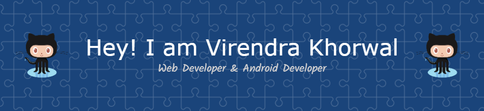

<h1> Hello Fellow < Developers/ >!  </h1>

 
 ## I'm Virendra Khorwal.😎

  Thank You for taking the time to view my GitHub Profile :smile: 

<h2> About Me </h2>

- 🔭 I’m currently working on Github projects

- 🌱 I’m currently learning Web3.0
 

- 👯 I’m looking to collaborate on Project related to web dev

- 💬 Talk to me about Python, JavaScript, Open Source, Web Dev, App dev 

- :octocat: Commited to github

<h2> Skills  </h2>

 
 <h2>Badges<h2>
  
  
  
  
  
  
  
  
  
  
  
  
  
  
  

<h2> Connect with me  </h2>
 
 

<h2> My GitHub Stats  </h2>

<!-- <a href="https://github.com/anuraghazra/github-readme-stats"> -->

</a>
<!-- <a href="https://github.com/anuraghazra/convoychat"> -->

</a>

<h2> Some Programming Humor for you </h2>
 

 
 <h3 align="left">Support:</h3>
 
  

  

